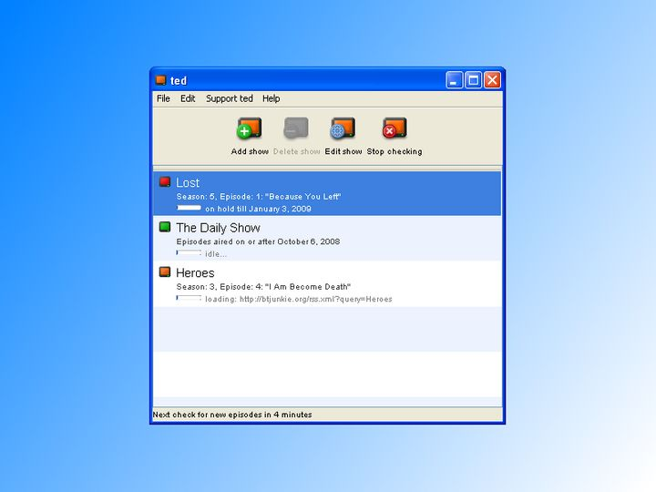
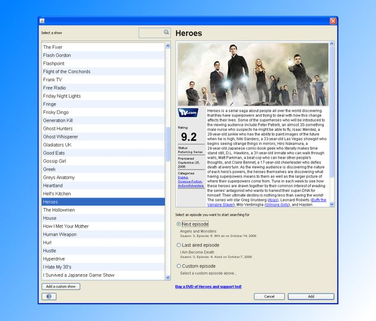
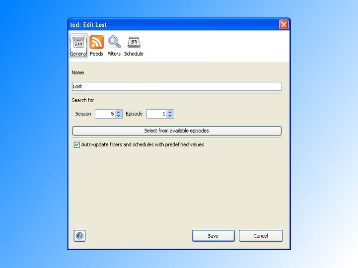

# ted-javacc

> ⚠️ This project was developed in 2009 and is no longer maintained ⚠️


Torrent Episode Downloader (TED) Expression parser using JavaCC.

## What is TED? 

TED is a program for automatically downloading your TV Shows torrents.

> Meet ted! Your new way of downloading tv shows from the web. Add your
> favourite tv shows to ted and ted will automatically download torrents of new
> episodes! Ted checks feeds from TorrentSpy, Isohunt and MyBittorrent for new
> episodes of tv shows.

### Screenshots







## What is this Project?

This project is an expression parser for filtering torrents in TED using JavaCC.

### Code Snippet Example

```java
public class Main {

    public static void main(String[] args) {

        TedParserKeywordChecker tedParserKeywordChecker =
                new TedParserKeywordChecker();

        String keywords = "((csi & ny) | (csi & new york)) & (!720p)";
        String name = "CSI: NY - 6x01 - Epilogue";

        boolean result = tedParserKeywordChecker.checkKeywords(
                name, keywords
        );

        System.out.println("Matched: " + result);
    }
}
```

## License

    TED Expression JavaCC Parser.
    Copyright (C) 2009  Tiago Santos

    This program is free software: you can redistribute it and/or modify
    it under the terms of the GNU General Public License as published by
    the Free Software Foundation, either version 3 of the License, or
    (at your option) any later version.

    This program is distributed in the hope that it will be useful,
    but WITHOUT ANY WARRANTY; without even the implied warranty of
    MERCHANTABILITY or FITNESS FOR A PARTICULAR PURPOSE.  See the
    GNU General Public License for more details.

    You should have received a copy of the GNU General Public License
    along with this program.  If not, see <http://www.gnu.org/licenses/>.

For the full license text refer to [LICENSE.md](LICENSE.md)
